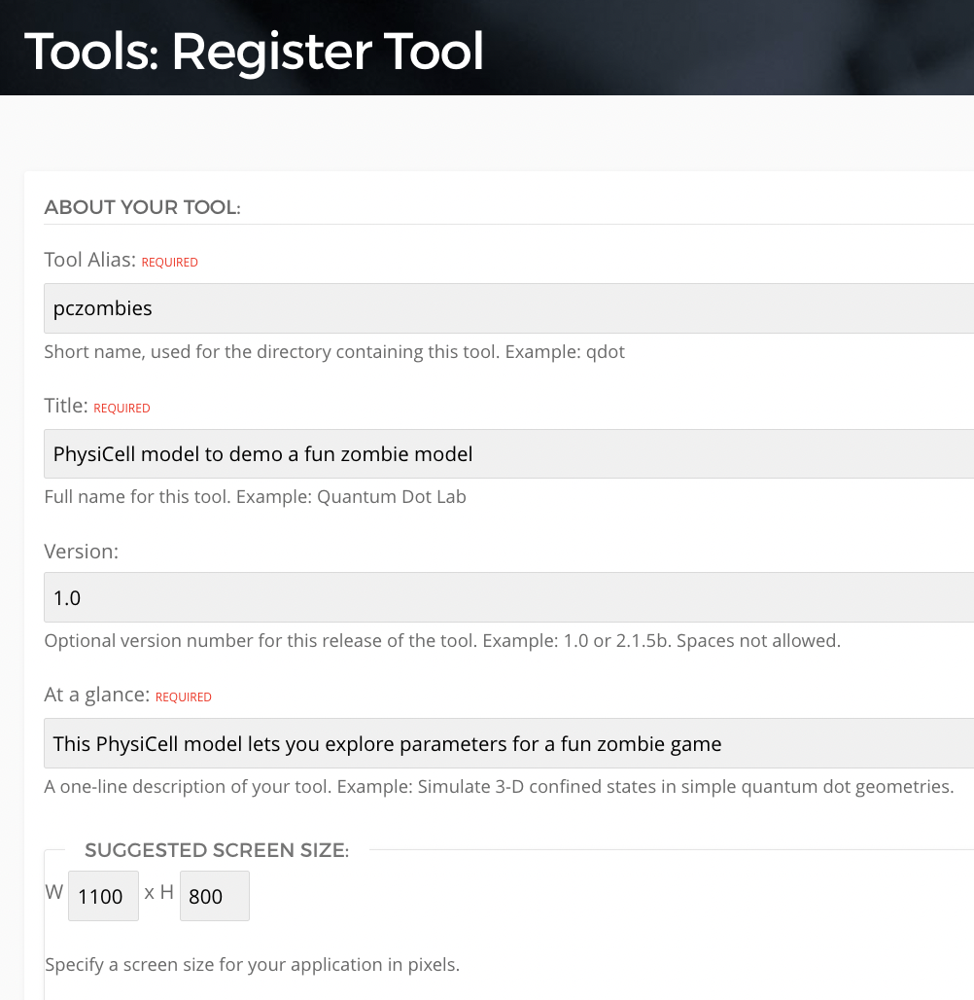
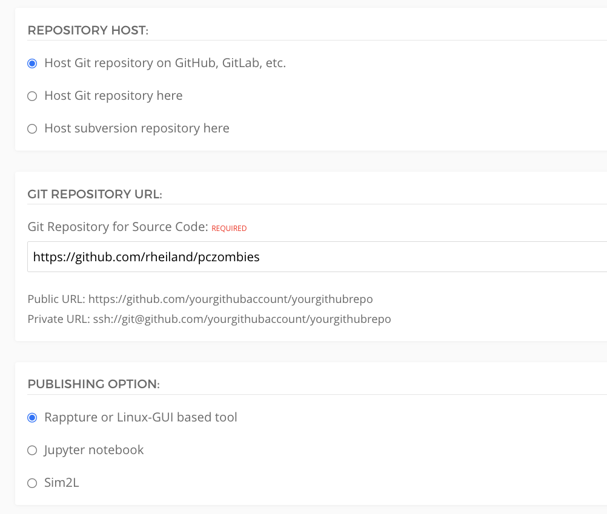
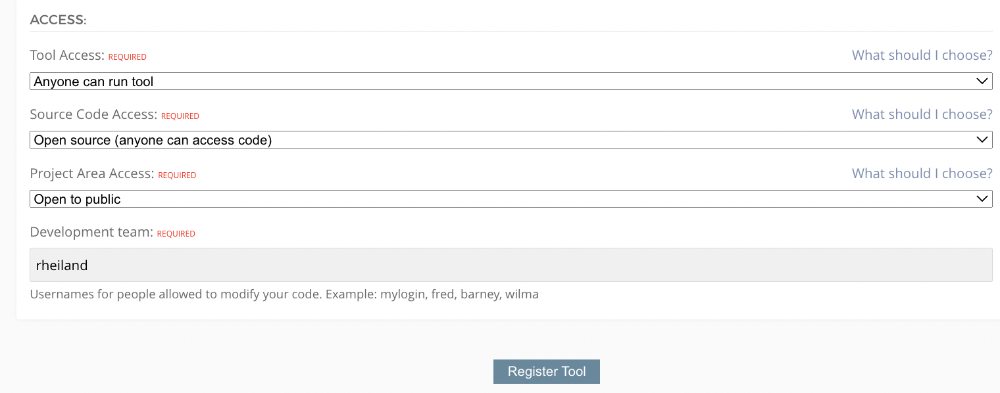
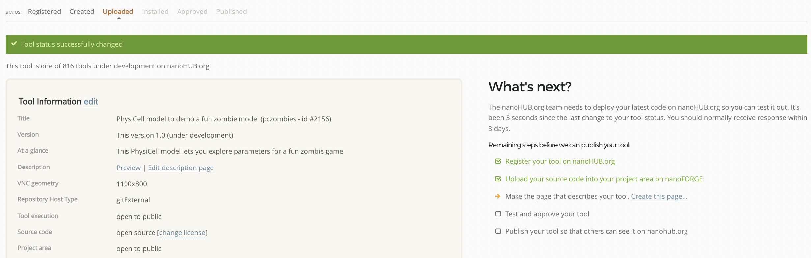

# nanohub-studio-app

This repository documents how one can generate a [nanoHUB](https://nanohub.org/) tool (a.k.a, "app") for a PhysiCell model that uses a [PhysiCell Studio](https://github.com/PhysiCell-Tools/PhysiCell-Studio)-style GUI. 

## High-level steps

1. Create a new, public repository in your github.com account that will be used exclusively for your nanoHUB app. 
2. Clone this repo to your computer, e.g.,:
```
   git clone git@github.com:rheiland/pczombies.git
   cd pczombies
```
3. Create a nanoHUB account if you do not have one: https://nanohub.org/register/
  * Students need to be aware that creating an account on nanoHUB is similar to creating an account on any social media platform. Use your good judgment about publicly sharing personal information. For more background, see https://ferpa.iu.edu/safeguarding/index.html
4. Register a new tool for your model: https://nanohub.org/tools/create
  * fill out the basic information for creating your nanoHUB tool. Tool Name should be 3-15 alphanumeric characters, including at least one non numeric character (e.g., ```pczombies```). Although not required, it’s probably wise to also use only lowercase characters. Provide the URL to your newly created GitHub repo (e.g., ```https://github.com/rheiland/pczombies```) and additional information, e.g., shown below. When you finally click the ```Register Tool``` button, you will be told if that tool name has already been taken, however, it may take a few seconds for that to appear. Also, don't worry if you forget to provide some info on this initial form, you can always edit it later.





5. Download the latest release of this sample nanoHUB [worms app](https://github.com/rheiland/pcworms/releases) and unzip it into the folder in step 2, then perform the following steps (all commands show here are for a Unix-type shell; substitute with appropriate Windows commands as needed):
```
~/git/pczombies$ unzip pcworms-0.1.zip
~/git/pczombies$ cd pcworms-0.1
```
Next,  delete the README.md and then move the contents of the `pcworms-x.x` up into the your repo's root, e.g., `pczombies`:
```
~/git/pczombies/pcworms-0.1$ rm README.md 
~/git/pczombies/pcworms-0.1$ mv *  ..
```
Confirm your folder has the desired files and subdirectories and then do some clean up, e.g.
```
~/git/pczombies/pcworms-0.1$ cd ..
~/git/pczombies$ ls
README.md		data/			rules0.csv
VERSION.txt		middleware/		src/
bin/			pcworms-0.1/		tmpdir/
config/			pcworms-0.1.zip

~/git/pczombies$ rm pcworms*.zip
~/git/pczombies$ rm -rf pcworms-0.1/
```

From the `src/custom_modules` directory, copy your original PhysiCell model's `custom_modules` files to here:
```
~/git/pczombies/src/custom_modules$ cp ~/PhysiCell/custom_modules/custom.h .
~/git/pczombies/src/custom_modules$ cp ~/PhysiCell/custom_modules/custom.cpp .
```
From the `data` directory, copy your original PhysiCell model's configuration file, cells .csv, and rules .csv files to here, with specific names:
```
~/git/pczombies/data$ cp ~/PhysiCell/config/PhysiCell_settings.xml mymodel.xml
~/git/pczombies/data$ cp ~/PhysiCell/config/cells.csv cells.csv
~/git/pczombies/data$ cp ~/PhysiCell/config/cell_rules.csv cell_rules.csv
```

Edit the `middleware/invoke` file and change `pcworms` to the name of your app, e.g., `pczombies`

6. Do a git `add`, `commit`, and `push` of the updated contents, e.g. (or however you perform github repo updates),
```
~/git/pczombies$ git add .
~/git/pczombies$ git commit -m "updates"
~/git/pczombies$ git push
```
7. Go to your nanoHUB app's `status` page (e.g., nanohub.org/tools/pczombies/status) and let them know you have updated your github repo and are ready to have them install it for testing by clicking the link that says "My code is committed, working, and ready to be installed" under the "We are waiting for you" section. You should receive an email telling you that the app's status has been updated. You will also be redirected to another page that describes next steps:


You then wait for another email (may take mins or hours) to let you know it has been installed on nanoHUB (or maybe there was an error attempting to install it) and is ready for testing. After that email, return to the app's `status` page where you can launch it for testing. Once you are satisfied that it is working correctly, you can request that the app be "published" which means it will be publicly available for anyone with a nanoHUB account to run.

